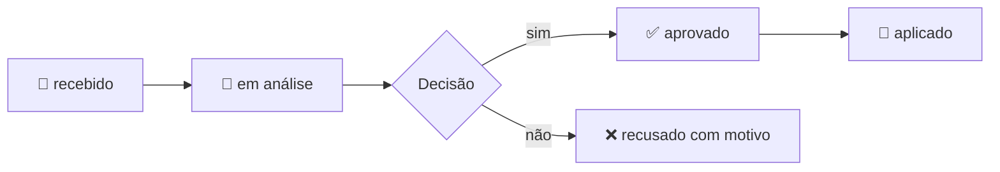

# ✍️ Como pedir uma mudança

Viu algo que precisa mudar, faltar ou melhorar? **Não edite os documentos** — faça um Pedido de Mudança. Assim nada se perde e tudo fica rastreado.

## Passo a passo
1. Abra sua IA de preferência e cole o prompt de `prompts/02-pedido-de-mudanca.md`.
2. Responda às perguntas com suas palavras.
3. Escreva **gerar** e mande o resultado para quem cuida da documentação.

## O que acontece depois

Quando aplicado, o pedido mostra **o que mudou**, e cada documento afetado ganha uma linha no seu Histórico.
